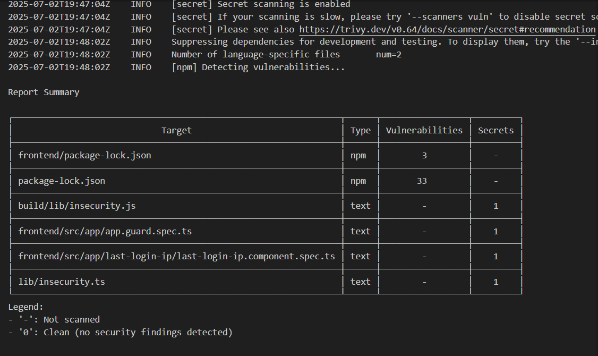
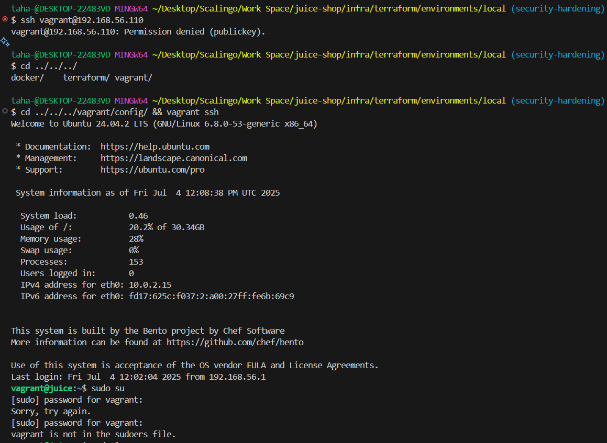
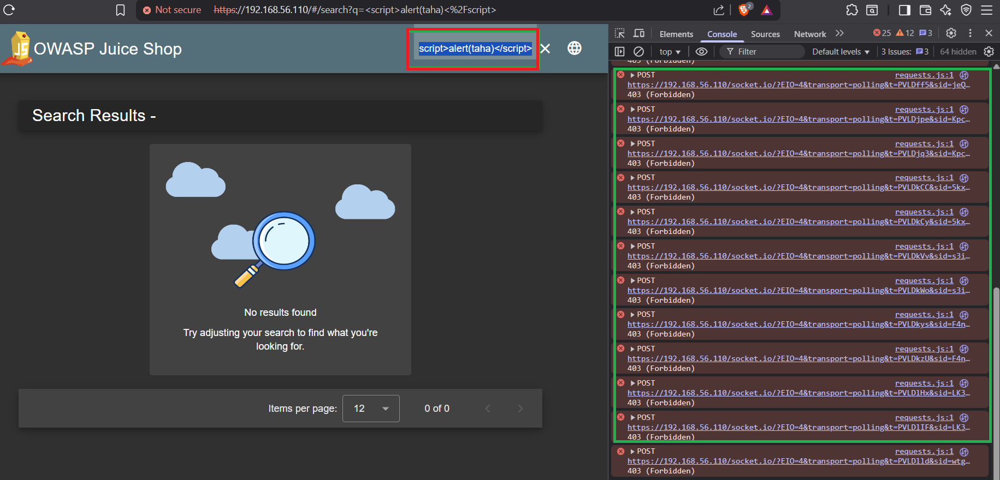
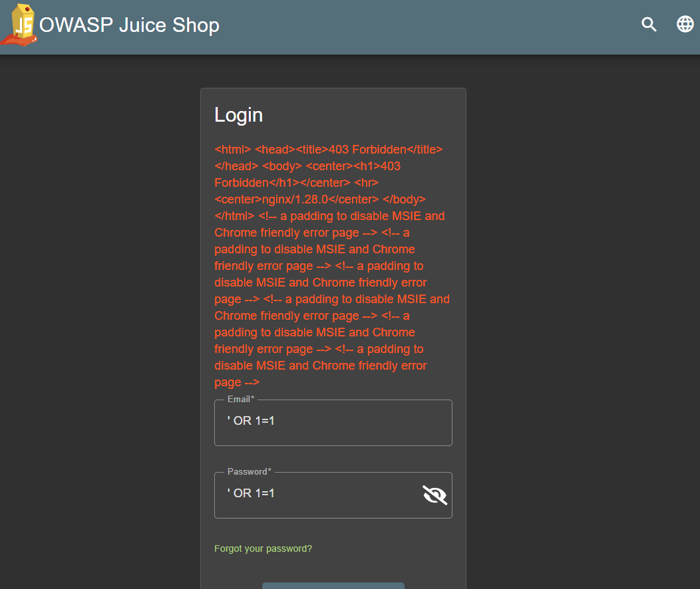

# OWASP Juice Shop - Technical Assessment for Scalingo

<p align="center">
  
  
  
</p>

<p align="center">
  <a href="https://github.com/ELHADANITAHA/Scalingo-TP">🔗 To access the GitHub repository Scalingo-TP, use the following link:</a>
</p>

> **Disclaimer:** This project leverages AI in a professional and educational way to identify, apply, and document best practices for secure infrastructure automation. All guidance, code, and documentation are produced with the intent to demonstrate industry standards and effective DevSecOps workflows.


## 📚 Table of Contents

1. [🚀 Before You Begin](#-before-you-begin)  
2. [✨ Project Overview](#-project-overview)  
3. [⚖️ Exercise 1 - Infrastructure Hardening and Compliance](#️-exercise-1---infrastructure-hardening-and-compliance)  
4. [🏗️ Architecture Clarification](#️-architecture-clarification)  
5. [🗂️ Project Directory Structure](#️-project-directory-structure)  
6. [📸 Screenshots & Proofs](#-screenshots--proofs)  
7. [🚨 Exercise 2 - Incident Response Plan](#-exercise-2---incident-response-plan)  
8. [📈 Exercise 3 - Security Advisory Communication](#-exercise-3---security-advisory-communication)  
9. [🔗 Authors & Credits](#-authors--credits)  
10. [⏳ Timeline & Submission](#-timeline--submission)  
11. [✅ Key Takeaways](#-key-takeaways)  

## 🚀 Before You Begin

- **Please ensure you have Docker and Vagrant installed and running** before starting the deployment. This project was developed and tested on Windows (using Git Bash), but every effort was made to keep the infrastructure cross-platform. For best results, use a similar environment to avoid Terraform or Docker execution issues.
- **Prerequisites:**
  - Git Bash (recommended on Windows)
  - Docker (latest stable)
  - Vagrant (latest stable)
  - Terraform (latest stable)

## ✨ Project Overview

This project secures a deployment of the vulnerable OWASP Juice Shop application. It simulates a real-world incident, provides a mitigation and response plan, and includes a concise security advisory.

---

## ⚖️ Exercise 1 - Infrastructure Hardening and Compliance

### Where to Start

- **Start the infrastructure from:** `infra/terraform/environments/local/main.tf`
- This is the entry point for the entire stack. All resources are managed as code.
- **To start the infrastructure:**
  1. `cd infra/terraform/environments/local`
  2. `terraform init`
  3. `terraform apply -auto-approve`
- **To stop and destroy everything:**
  1. `cd infra/terraform/environments/local`
  2. `terraform destroy -auto-approve`

### Architecture Overview

```
[Host OS]
   |\
   | +-----------------------------+
   | |  SAST (Trivy) Container     |
   | |  Ansible Container          |
   | +-----------------------------+
   |
[Vagrant VM (Ubuntu 24.04)]
   |
[Docker Engine]
   |
+-----------------------------+
|  WAF (ModSecurity CRS)      |
|  NGINX Reverse Proxy        |
|  Juice Shop Web App         |
+-----------------------------+
```
---

💡 **Note:** Ansible & Trivy containers are **host-side tools**, not deployed within the Vagrant VM. They interact with the VM over SSH and Docker.

---
#### Tooling & Workflow

- **Terraform** is the IaC orchestrator. It builds:
  - The Vagrant VM (Ubuntu 24.04)
  - Docker containers for:
    - **SAST (Trivy):** Scans the Juice Shop image for vulnerabilities and secrets, providing actionable remediation steps.
    - **Ansible:** Centralizes all automation, deployment, and hardening tasks. All playbooks are executed from this container.
  - **TLS certificates** (self-signed) for secure HTTPS, generated and injected into the containers.
- **Vagrant VM** is the main host for the application stack. Docker is installed here to run all app and security containers.
- **Docker** runs:
  - **Juice Shop** (Node.js vulnerable app)
  - **NGINX Reverse Proxy** (HTTP, load balancing, traffic forwarding)
  - **WAF (ModSecurity CRS):** (HTTPS, First line of defense, filtering and blocking web attacks)

#### Security Chain

```
[Internet/Host] → [Vagrant VM] → [WAF (ModSecurity)] → [NGINX Reverse Proxy] → [Juice Shop App]
```
- **WAF**: Terminates HTTPS, Filters and blocks malicious traffic (OWASP Top 10, CVEs, XSS, SQL injection, etc.)
- **NGINX**: Terminates HTTP, load balances, and forwards only clean traffic
- **Juice Shop**: Isolated, never directly exposed
- **Custom Docker Network**: Ensures containers communicate only as intended

#### Security Hardening Measures (with CVE/Compliance Mapping)

- **SSH Hardening (CIS/ISO 27001 A.9.2.1, A.13.1.1):**
  - Disabled root login and password authentication (`sshd_config`)
  - Enforced key-based authentication only
  - Removed `NOPASSWD` sudo for all users
  - Removed `vagrant` from sudo group
  - Set strict file permissions on keys and configs
  - **Mitigates:** CVE-2018-15473 (OpenSSH user enumeration), CVE-2016-0777 (key leak)

- **OS Hardening (CIS/ISO 27001 A.12.6.1):**
  - Installed and configured `fail2ban`, `ufw` (firewall), `auditd`
  - Enforced UFW default deny, only allowed required ports (80, 443)
  - Set up audit rules for critical files
  - **Mitigates:** CVE-2016-4484 (unauthorized access), CVE-2019-6111 (OpenSSH scp)

- **Docker Security (CIS Docker Benchmark):**
  - Custom bridge network for container isolation
  - No direct exposure of internal containers 
  - Read-only file systems for NGINX/WAF where possible
  - **Mitigates:** CVE-2019-5736 (runc container escape)

- **TLS/Certificate Management (ISO 27001 A.10.1.1):**
  - Self-signed certs generated by Terraform, never hardcoded
  - Private keys never exposed in code or images
  - **Mitigates:** CVE-2014-0160 (Heartbleed), CVE-2015-4000 (Logjam)
  - ⚠️ This setup uses self-signed certificates for demonstration purposes. In a production environment, use trusted CAs (e.g., Let's Encrypt) and proper secret management (e.g., HashiCorp Vault). High availability, backup, and advanced monitoring are also required for production.

- **WAF (ModSecurity CRS) (OWASP Top 10, ISO 27001 A.13.1.1):**
  - Blocks SQLi, XSS, RCE, and other web attacks
  - Custom rules for Juice Shop endpoints
  - **Mitigates:** CVE-2017-5638 (Struts2 RCE), CVE-2019-11043 (PHP-FPM RCE)

- **NGINX Reverse Proxy (CIS/ISO 27001 A.13.1.1):**
  - Only proxies to internal Docker network
  - Enforces HTTPS, disables weak ciphers, Loadbalancing
  - **Mitigates:** CVE-2013-2028 (buffer overflow), CVE-2017-7529 (range header DoS)

- **SAST (Trivy) (ISO 27001 A.12.6.1):**
  - Automated scan of Juice Shop image for vulnerabilities and secrets
  - Reports saved for audit and remediation
  - **Mitigates:** CVE-2023-29017 (vm2 sandbox escape), CVE-2020-8203 (lodash.set prototype pollution)

- **Secrets Management (ISO 27001 A.9.2.3):**
  - No secrets or private keys in codebase
  - All sensitive data loaded via environment or injected at runtime
  - **Mitigates:** CVE-2021-23337 (lodash command injection), CVE-2018-16487 (lodash prototype pollution)

- **Idempotent, Modular IaC (ISO 27001 A.12.1.2):**
  - All provisioning is repeatable, versioned, and documented
  - Clear separation of roles and configs

#### How to Deploy

1. `cd infra/terraform/environments/local`
2. `terraform init && terraform apply -auto-approve`
3. All containers and hardening will be provisioned automatically
4. SAST scan results will be available in `/SAST/Scan_report_Juice-shop-image` (inside the SAST container via `docker exec sast-runner cat //SAST/Scan_report_Juice-shop-image > trivy_scan.txt && nano trivy_scan.txt`)
5. To access the secured Juice Shop web application: [https://192.168.56.110](https://192.168.56.110)

---

## 🏗️ Architecture Clarification

- **Host Machine:**
  - Runs Terraform and Docker directly.
  - Docker on the host creates and manages two key containers:
    - **Ansible container:** Used for automation, deployment, and hardening tasks (not inside the VM).
    - **SAST (Trivy) container:** Used to scan the Juice Shop image for vulnerabilities and secrets (not inside the VM).
- **Vagrant VM (Ubuntu 24.04):**
  - Only runs the application stack as Docker containers:
    - **Juice Shop Web App**
    - **NGINX Reverse Proxy**
    - **WAF (ModSecurity CRS)**
  - Hardened with firewall (UFW), fail2ban, auditd, SSH restrictions, and other security measures.

This separation ensures that automation and security scanning are isolated from the application environment, following best practices for defense in depth and least privilege.

---

## 🗂️ Project Directory Structure

```
infra/
├── docker/
│   ├── Ansible/
│   │   ├── config/
│   │   │   └── run-ansible.sh         # Entrypoint script for all Ansible automation
│   │   ├── playbooks/
│   │   │   ├── ansible.cfg            # Ansible configuration file
│   │   │   ├── inventory.ini          # Inventory of managed hosts (VM)
│   │   │   └── scripts/
│   │   │       ├── deployment/
│   │   │       │   └── deploy.yml     # Main deployment playbook
│   │   │       ├── roles/
│   │   │       │   ├── juice_shop/tasks/main.yml           # Juice Shop container deployment tasks
│   │   │       │   ├── nginx_reverse_proxy/
│   │   │       │   │   └── tasks/main.yml                  # Nginx container deployment tasks
│   │   │       │   ├── vagrant-hardening/
│   │   │       │   │   ├── handlers/main.yml               # Handlers for hardening (e.g., restart ssh)
│   │   │       │   │   └── tasks/main.yml                  # OS/VM hardening tasks
│   │   │       │   └── waf_mobsecurity/
│   │   │       │       ├── files/default.conf.template     # WAF config template
│   │   │       │       └── tasks/main.yml                  # WAF container deployment tasks
│   │   │       └── security/vagrant-hardening.yml          # Playbook for VM hardening
│   │   └── templates/dockerfile.tpl                        # Dockerfile template for Ansible image
│   └── SAST/
│       ├── config/entrypoint.sh                            # Entrypoint for Trivy SAST scan
│       └── templates/dockerfile.tpl                        # Dockerfile template for SAST image
├── terraform/
│   ├── environments/local/
│   │   ├── main.tf                                         # Main Terraform entrypoint
│   │   ├── variables.tf                                    # Terraform variables
│   │   └── ...                                             # State and lock files
│   └── modules/infra_module/
│       ├── main.tf                                         # Module logic (VM, Docker, etc.)
│       ├── outputs.tf                                      # Module outputs
│       ├── variables.tf                                    # Module variables
│       └── versions.tf                                     # Provider versions
└── vagrant/
    ├── config/                                            # Vagrant runtime config
    └── templates/vagrantfile.tpl                           # Vagrantfile template for VM
```

**File/Folder Explanations:**
- `run-ansible.sh`: Central script to run all Ansible playbooks for deployment and hardening.
- `ansible.cfg`, `inventory.ini`: Ansible configuration and inventory for targeting the VM.
- `deploy.yml`: Main playbook to deploy Juice Shop, Nginx, and WAF containers.
- `roles/juice_shop/tasks/main.yml`: Tasks to deploy the Juice Shop container.
- `roles/nginx_reverse_proxy/tasks/main.yml`: Tasks to deploy the Nginx container.
- `roles/vagrant-hardening/handlers/main.yml`: Handlers for hardening actions (e.g., restart ssh).
- `roles/vagrant-hardening/tasks/main.yml`: OS/VM hardening tasks (firewall, sudo, SSH, etc.).
- `roles/waf_mobsecurity/files/default.conf.template`: WAF (ModSecurity) config template.
- `roles/waf_mobsecurity/tasks/main.yml`: Tasks to deploy the WAF container.
- `security/vagrant-hardening.yml`: Playbook to apply all hardening tasks.
- `dockerfile.tpl`: Dockerfile templates for building Ansible and SAST images.
- `main.tf`, `variables.tf`, `outputs.tf`, `versions.tf`: Terraform files for infrastructure as code (VM, Docker, network, certs, etc.).
- `vagrantfile.tpl`: Template for the Vagrant VM definition.

---

---

## 📸 Screenshots & Proofs

### 1. Trivy Scan (SAST)
> 
*Example: Trivy scan result showing detection of critical vulnerabilities.*

### 2. SSH Access Denied (Hardening)
> 
*Example: SSH login attempt denied (password authentication disabled).*

### 3. WAF ModSecurity – XSS Attack Blocked
> 
*Example: Log or 403 Forbidden page generated by the WAF when an XSS attack is attempted.*

### 4. WAF ModSecurity – SQL Injection Blocked
> 
*Example: Log or 403 Forbidden page generated by the WAF when a SQL injection attack is attempted.*

---

## 🚨 Exercise 2 - Incident Response Plan

### Scenario: Critical Vulnerability in Juice Shop (vm2 Sandbox Escape)

**Description:**
A critical vulnerability (CVE-2023-29017, CVE-2023-29199, etc.) was found in the `vm2` dependency, allowing attackers to escape the Node.js sandbox and execute arbitrary code on the server. This was detected by the Trivy SAST scan.

#### 1. Identification
- Trivy flagged `vm2` as critically vulnerable in the Juice Shop image (e.g., used in `insecurity.js` for sandbox evaluation)
- Security team receives alert and confirms exploitability

#### 2. Containment
- Immediately block all external access to the Juice Shop container via firewall and WAF
- Patch or remove the vulnerable `vm2` dependency (if possible)
- Notify stakeholders and begin incident response

#### 3. Eradication
- Remove all vulnerable versions of `vm2` from the codebase
- Rebuild and redeploy the Juice Shop container with patched dependencies
- Scan the new image with Trivy to confirm remediation

#### 4. Recovery
- Restore service with the patched image
- Backups and Snapshots Maintenance
- Monitor logs and network traffic for signs of compromise
- Conduct a post-mortem and update incident response documentation

#### Post-Incident Analysis
- **Root Cause:** Use of a critically vulnerable dependency (`vm2`) in the application
- **Lessons Learned:**
  - Integrate SAST/DAST into CI/CD
  - Regularly update and audit dependencies
  - Enforce dependency policies in code reviews
- **Preventive Measures:**
  - Automated SAST scans (Trivy, OSV-Scanner, CodeQL etc..)
  - Dependency whitelisting/blacklisting
  - Security training for developers

---

## 📈 Exercise 3 - Security Advisory Communication

### Scalingo-Style Security Bulletin (SSB)

**ID:** SSB-2025-07-JUICESHOP-CRITDEP
**Date:** 2025-07-03
**Component:** Juice Shop (Node.js, all versions <= 15.0.0)
**Severity:** Critical
**Vector:** Vulnerable dependency (`vm2`)

#### Summary
A critical sandbox escape vulnerability was discovered in the Juice Shop application due to the use of a vulnerable version of the `vm2` library. This could allow attackers to execute arbitrary code on the server, leading to full system compromise.

#### Impact
- Remote code execution
- Data exfiltration or destruction
- Lateral movement within the infrastructure

#### Mitigation
- Immediately update or remove the `vm2` dependency
- Rebuild and redeploy the application
- Audit all dependencies for similar issues

#### Resolution
The vulnerable dependency has been removed and the application image rebuilt. All users are advised to scan their own deployments and update as necessary.

#### References
- [CVE-2023-29017](https://nvd.nist.gov/vuln/detail/CVE-2023-29017)
- [Trivy Documentation](https://aquasecurity.github.io/trivy/)
- [OWASP Top 10: A06 - Vulnerable and Outdated Components](https://owasp.org/Top10/A06_2021-Vulnerable_and_Outdated_Components/)
- [OWASP Juice Shop: Probably the most modern and sophisticated insecure web application](https://github.com/juice-shop/juice-shop/))

---

## 🔗 Authors & Credits

- Taha EL HADANI - Junior Security Engineer
- Based on OWASP Juice Shop, Docker, ModSecurity CRS
- Trivy (by Aqua Security) used for scanning

---

## ⏳ Timeline & Submission

- Deadline respected: 7 days
- GitHub repo shared privately with Scalingo team:
  - [@yanjost](https://github.com/yanjost)
  - [@leo-scalingo](https://github.com/leo-scalingo)
  - [@john-scalingo](https://github.com/john-scalingo)
  - [@sc-jerome-s](https://github.com/sc-jerome-s)

---

## ✅ Key Takeaways

- The infrastructure is fully managed as code (IaC) using Terraform and Ansible for automation, repeatability, and auditability.
- Security is enforced at every layer: WAF, reverse proxy, SAST, OS hardening, and strict secrets management.
- All automation, deployment, and hardening are centralized and reproducible.
- The Juice Shop application is fully isolated, protected by a hardened and shielded infrastructure, and all best practices for DevSecOps have been applied.

---

